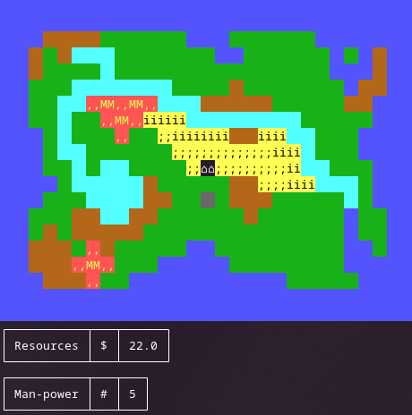
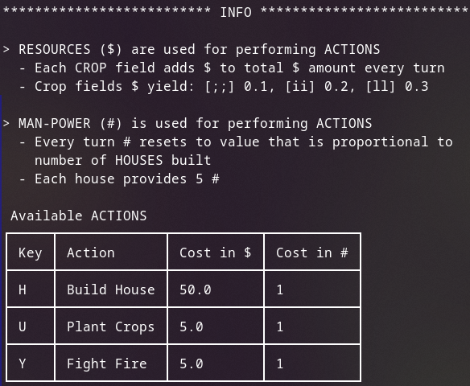

# ASCIIV
### - ASCII Civilization Game -

Tiny terminal based game about building civilization and fighting natural disasters.

## Run the game

Download executable: [Releases](https://github.com/dr460r/asciiv/releases)

To run the game you need ANSI-compatible terminal emulator.

## Development

My dev setup:
- OS: GNU/Linux
- Haskell project manager: [Stack](https://docs.haskellstack.org/en/stable/)
- IDE: VSCodium + Haskell extensions
